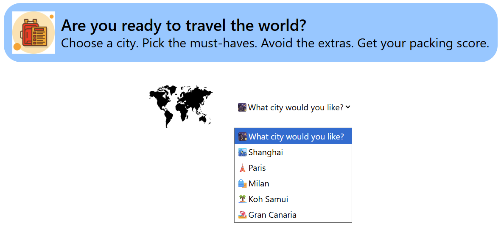
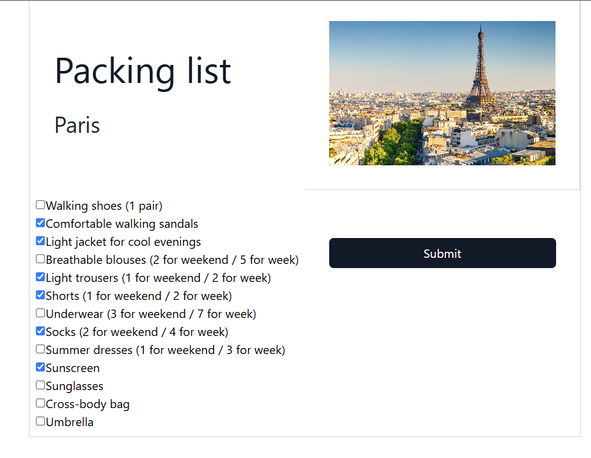
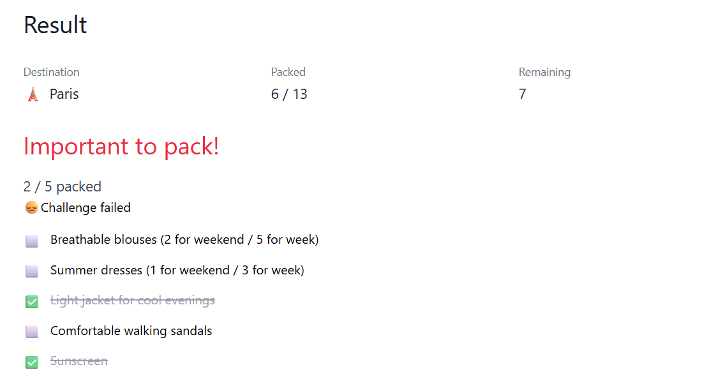

## 1. Website Theme

## Travel Packing Quiz

A single-page interactive quiz application where users test their travel preparation skills.

## 2. Overview

The user is presented with a travel city and must select the essential packing items from a mixed list of options. After submitting their choices, the app calculates a score based on how many correct items they selected (and how many wrong items they avoided).

This is **not** a standard to-do list or packing checklist — it is a quiz-style game that tests the user's knowledge of what to pack for summer trips and activities.

## 3. Features & Functionality

### 3.1 City Selection
- The page displays 5 travel cities as clickable choices.
- Each choice shows:
  - City name
  - Emoji icon
- Clicking a city selects it as the current city and reveals the packing list.

### 3.2 Packing Item Selection
- Once a city is selected, a list of packing items appears.
- The list contains both:
  - Essential (correct) items for that city
  - Decoy (incorrect or non-essential) items
- The user can click items to toggle them on/off (selected/unselected).
- Selected items get a visual “checked” style.

### 3.3 Submit & Result
- A **“Check Packing”** button submits the user’s selection.
- The app compares the user’s choices against the correct packing list (`essentialItems`).
- **Scoring logic:**
  - +1 point for each **essential** item that is selected.
  - Incorrectly selected decoy items **do not affect the score** (no penalty).
  - The score equals the number of correctly selected essential items.
- The result is displayed immediately after submission, including:
  - Final score
  - Feedback on correctly selected essential items
  - (Optionally) missed essential items and incorrectly selected decoy items

## 4. Component Structure(6 components)

```text
src/
├── Header
│   └── Displays the main title (e.g., "Travel Packing Quiz")
├── SubTitle
│   └── Displays the subtitle in the header (e.g., "Test your packing skills")
├── Selector
│   └── Renders 5 city choices and handles city selection
├── ListItems
│   └── Renders item buttons with toggle selection inside PackingList
├── PackingList
│   └── Renders city name, city image, and the full list of packing items
└── Result
    └── Shows score, correct/incorrect items, and feedback message
```
**State ownership (top-level page component):**

- `selectedCity: TravelCity | null`
- `selectedItems: string[]`
- `score: number | null`

Child components receive props and callbacks from this parent.

## 5. Data Structure
```ts
TravelList Data
typescript
type travelType = {
  id:number,
  icon:string,
  name:string,
  img:string,
  importantList:string[],
  allPackItems:string[]
}

Example: Shanghai
id: 1,
icon: "🏙️",
name: "Shanghai",
img: "Shanghai.jpg",
importantItems: [
  "Light cotton T-shirts (2 for weekend, 5 for week)",
  "Shorts (1 for weekend, 3 for week)",
  "Sunscreen SPF 50+",
  "Portable fan",
  "Umbrella (summer rain)"
]
allPackItems: same as above + [
  "Sneakers (1 pair)",
  "Sandals (1 pair)",
  "Sunglasses",
  "Hat/cap",
  "Jeans/light pants (1 for weekend / 2 for week)",
  "Underwear (3 for weekend / 7 for week)",
  "Socks (2 for weekend / 5 for week)",
  "Power bank",
  "Travel adapter",
] 
``` 
## 6. User Flow (Step-by-Step)
1. **Page loads**  
   - User sees 5 city choices.  
   - No packing list is shown.  
   - “Check Packing” button is disabled.

2. **User clicks a city**  
   - The app displays that city’s `allPackItems` as a mixed list of essential and decoy items.

3. **User selects items**  
   - Clicking an item toggles its selection.  
   - Selected items are visually highlighted.

4. **User clicks “Check Packing”**  
   - The app calculates the score based on `essentialItems` vs. `selectedItems`.  
   - The `Result` component shows:
     - Score
     - List of correctly selected essential items
     - (Optionally) missed essential items
     - (Optionally) incorrectly selected decoy items

5. **User selects a different city**  
   - The packing list and result reset for the new city.  
   - Previously selected items are cleared.

## 7. Screenshots




## 8. Technologies
- Next.js
- TypeScript
- Vitest (or Jest) + React Testing Library
- Tailwind CSS

## 9. Team(Division of Work)
| Component        | Responsible |
|------------------|-------------|
| Header           | Gabi        |
| SubTitle         | Ting        |
| Selector         | Ting        |
| PackingList      | Gabi        |
| ListItems        | Ting        |
| Result           | Gabi        |
| Integration tests| Both        |
| Data file        | Ting        |

## 10. Testing Strategy
All tests are written in TypeScript.

### Unit Tests (≥20 total)

Focus areas and example checks:

- **Selector**
  - Renders 5 city buttons.
  - Clicking a city calls `onSelectCity` with the correct city.
  - Selected city is visually distinguished.
  - Uses `getByRole` to access city buttons.

- **ListItems**
  - Renders all items from `allPackItems`.
  - Clicking an item toggles its selection.
  - Selected items have the correct visual state.
  - Uses `getAllByRole` to query multiple item buttons.
  - Decoy items are rendered but are not in `essentialItems`.

- **Result**
  - Shows the correct score.
  - Lists correctly selected essential items.
  - (If implemented) lists missed essential items.
  - (If implemented) lists incorrectly selected decoy items.

- **Header / SubTitle**
  - Render expected title and subtitle text.
  - Use appropriate heading levels (`h1`, `h2`) for accessibility.

- **PackingList**
  - Shows city name and image when a city is selected.
  - Passes correct props to `ListItems` and `Result`.
  - “Check Packing” button is disabled until a city is selected (if implemented).
  - Calls `onSubmit` when clicked.

**Accessibility-focused checks:**

- City buttons have role `button` and accessible labels.
- Item toggles use `button` or `checkbox` with appropriate `aria-pressed` or `aria-checked`.
- Headings use semantic levels (`h1`, `h2`, etc.).

### Integration Tests (≥3 total)

1. **Full flow**
   - Render app.
   - Select “Shanghai”.
   - Select a mix of essential and decoy items.
   - Click “Check Packing”.
   - Assert:
     - Score equals the number of correctly selected essential items.
     - Result text includes expected feedback.

2. **City switch resets state**
   - Select “Shanghai”.
   - Select some items.
   - Switch to another city (e.g., “Paris”).
   - Assert:
     - Packing list now shows Paris items.
     - Previously selected Shanghai items are no longer selected.
     - Result is cleared or updated for the new city.

3. **Scoring logic**
   - Select a city.
   - Select:
     - All essential items.
     - Some decoy items.
   - Submit.
   - Assert:
     - Exact score matches number of essential items selected.
     - Decoy items do not increase the score.


## 11. Notes
The website UI will not be assessed – only the proposal and tests.

The tests should clearly communicate to another developer how the app should behave.

All tests are written in TypeScript.

## 12. Images & Data Files
City images: public/*.jpg

Data file: src/data/city.ts


